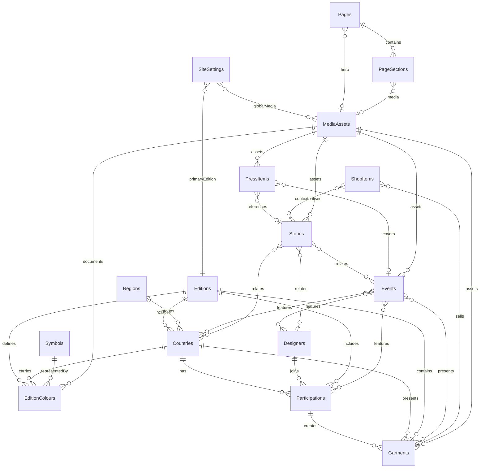

# CMS specification for the redesigned frontend

This is the content model for the navigation and routes implemented under `headless/`:
About, Edition One, Events, Stories, Shop, Press and Contact, and Partner With Us.
It replaces the original eight-collection Phase 1 model.

The model separates reusable cultural/editorial entities from page composition. It
does not treat a page as the owner of a country, designer, event, story or media
record. This prevents duplicated biographies, event facts and image rights data.

## Security and publication model

All collections allow visitor reads from their published base collection. `insert`,
`update` and `remove` remain `ADMIN`. Every collection uses Wix's `PUBLISH` plugin
with new items defaulting to `DRAFT`; drafts do not become public until explicitly
published through the Wix lifecycle.

The frontend queries only allowlisted base collections with Wix's visitor identity.
It never queries `__drafts`, uses an administrative token in browser code, or exposes
an elevated generic CMS proxy. Direct anonymous tests verify that published reads
succeed and draft reads remain inaccessible.

`approvedAt` and `sourceVersion` record provenance. They are validation fields, not
access controls. A missing approval blocks publication even when a record is otherwise
complete. No cultural meaning, biography, credit, contact address, partner claim,
price or media permission may be inferred to complete a record.

## Collections

Every collection includes `title`, `slug`, `summary`, `displayOrder`, `sourceVersion`
and `approvedAt`. Wix supplies the immutable item ID.

| Collection | Purpose | Important fields and relationships |
|---|---|---|
| `SiteSettings` | One global site record. | Site/header identity, taglines, footer/copyright copy, announcement controls, canonical origin and verified external links; SEO defaults, primary edition and global media references. |
| `Pages` | Route-level metadata, hero content and one-level navigation for the seven primary pages and home. | Stable `pageKey`, path, header/footer navigation labels, visibility/order/highlight controls, hero copy, introduction, two CTAs, SEO/robots fields and social/hero media. |
| `PageSections` | Ordered static-page sections. | Section key/type, eyebrow, heading/subheading, body, caption, approved tone/layout variant, optional CTA and enabled flag; belongs to one `Pages` item and may reference one `MediaAssets` item. |
| `Editions` | Edition-level editorial content. | Year, lifecycle label, statement, fabric description, colour narrative and creative process; hero/fabric media; related events. |
| `Regions` | Controlled display vocabulary for the five-region presentation. | Region key, name and approved description. A region assignment can therefore be reviewed without silently rewriting country data. |
| `Countries` | One country's participation/profile in one edition. | Country name, profile state, approved introduction, interpretation, participation and credits; references edition, region, hero/supporting media, symbol and related events. `principalDesigner` remains as a compatibility field; `Participations.isPrincipal` is authoritative. Unique business key: edition + slug. |
| `EditionColours` | The twelve ordered colour-to-country assignments. | Name, screen hex, accessible text hex, measured contrast and source position; references edition, country, optional symbol and optional source media. These are screen samples, not national flags or print specifications. |
| `Symbols` | Approved symbol records. | Verified name, meaning, origin, acknowledgement and public source; artwork references `MediaAssets`. Unknown meanings remain empty. |
| `Designers` | Reusable person/studio profile. | Approved display/studio names, professional title, biography, statement, location and verified links; portrait references `MediaAssets`. |
| `Participations` | Join entity between edition country and designer. | References edition, country and designer; carries role, principal flag, approval state, selection context, public credit and participation-specific statement. This distinguishes a principal designer from finalists, entrants and collaborators without duplicating the designer. |
| `Garments` | Finished garment/accessory records. | Look number, item type, technique, description and credits; references participation, designer, country, edition, hero/gallery media and event appearances. Redundant direct references support simple page queries and must agree with the participation record. |
| `Events` | Event listing and detail content. | Type, supplied date/time labels, exact start/end instants, timezone label, venue/location, confirmed/featured flags, overview, programme, admission and accessibility; references edition, countries, designers, participations, garments and media/resources. |
| `MediaAssets` | Rights-aware source of all visual and downloadable media. | Desktop/mobile files, dimensions, ratio, focal point, alt/decorative state, caption, creator, rights holder, credit, permission, usage terms, version and download controls. Display approval does not imply download approval. |
| `Stories` | Story index and article pages. | Category, date labels/instant, author, standfirst, excerpt and rich body; hero media plus related countries, designers and events. |
| `PressItems` | Releases, press kits, approved downloads and verified coverage. | Item type, headline/publication/date, rich body, version/size, external URL and download flag; optional media asset, event and story references. A planning PDF must never be relabelled as a press kit. |
| `PartnershipOptions` | Repeating cards and form choices on Partner With Us. | Type (`collaborator`, `format` or `enquiry`), label, approved description, form value, enabled state and optional media. Inquiry submissions belong to Wix Forms later, not CMS. |
| `ContactChannels` | Public contact routes shown on Press and Contact. | Channel key, label, purpose, address, response note, public-use verification and enabled state. An address cannot render until both booleans are true. |
| `ShopItems` | Editorial bridge to future Wix Stores products. | Wix product ID, editorial story, type, availability and fulfilment labels, commerce-enabled flag; references edition, country, garment, media and stories. Price, inventory, variants, cart and checkout must come from Wix Stores, never be duplicated in CMS. |

## Relationship diagram

## Frontend query contract

| Frontend route | Primary reads |
|---|---|
| `/` | `SiteSettings`, home `Pages`/`PageSections`, primary `Editions`, ordered `EditionColours` and `Countries`, next confirmed `Events`, latest `Stories`. |
| `/about` | About `Pages`/`PageSections`, founder-related media and milestone sections. |
| `/edition-one` | Edition by slug; region-grouped countries, ordered colours, principal participations and garments. |
| `/edition-one/[country]` | Country by edition + slug; region, ordered colours, principal/all participations, symbols, garments, related events and rights-cleared media. Unknown or unpublished slugs return 404. |
| `/events` and `/events/[slug]` | Confirmed events ordered by `startsAt`; edition/participant/media relations. Unknown or unpublished slugs return 404. |
| `/stories` and `/stories/[slug]` | Published stories ordered by published date with related country/designer/event records. Unknown or unpublished slugs return 404. |
| `/shop` and `/shop/[slug]` | Published `ShopItems` plus the matching Wix Stores product by `wixProductId` once commerce is enabled. CMS never supplies price or stock. |
| `/press-contact` | Page copy, verified `PressItems`, approved downloadable media and enabled/verified `ContactChannels`. |
| `/partner-with-us` | Page copy and enabled `PartnershipOptions`; the future submission path is Wix Forms. |

Every query has an explicit field projection, stable sort and limit. References are
expanded only when needed. Pages render honest empty states when a required approved
record is absent; they do not substitute draft fixtures in a public response.

## Content entry and publication sequence

1. Enter global settings, pages and page sections as drafts.
2. Enter media metadata first; retain files privately until rights are confirmed.
3. Enter regions, edition and country profiles.
4. Enter colours and verified symbols.
5. Enter designers, then participation records, then garments.
6. Enter events and connect their participants, garments and resources.
7. Enter stories, press items, partnership options and verified contact channels.
8. Create a `ShopItems` record only after a corresponding Wix Stores product exists.
9. Validate required fields, unique slugs, relationship consistency, media rights and approval evidence.
10. Publish dependencies before the records that reference them. Test direct anonymous list and item reads after permissions are changed at the later integration gate.

Multi-reference item links use Wix's dedicated insert/replace/remove reference APIs;
arrays in ordinary item writes are not treated as proof that a relationship was saved.

## Migration from the original foundation

The update is additive: every existing stable ID and field remains. Missing global,
page, section and one-level navigation controls are added to the existing collections. Historical
fields such as `Countries.regionLabel`, `Countries.principalDesigner`, event date
fragments and redundant garment references remain temporarily so the schema can be
updated without deleting fields. The content-access layer will prefer `Regions`,
`Participations` and exact event instants. Deprecated fields can be removed only after
the new access layer is working and the collections are still verified empty.

The initial wiring publishes only the two approved page records, the founder section,
and the two client-supplied images. It does not activate forms or commerce, release
the website, change a domain, or touch the Editor site
`cf6dc8aa-2320-4c66-b52e-44252adf69f3`.
